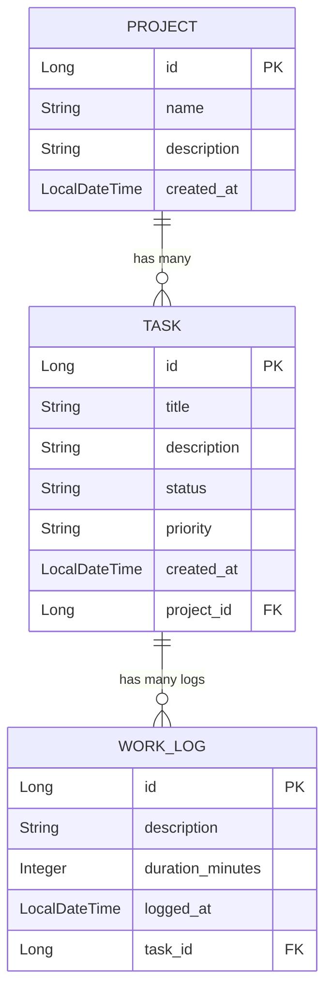

# ⏱️ WorkLog Tracker

**WorkLog Tracker** adalah aplikasi berbasis web yang dibangun dengan ekosistem Spring Boot dan Thymeleaf. Aplikasi ini dirancang untuk memudahkan individu maupun tim dalam melacak waktu (time tracking) yang dihabiskan untuk berbagai tugas dan proyek.

Dokumen ini berfungsi ganda sebagai **Product Requirements Document (PRD)** sekaligus **Technical Documentation** untuk memberikan panduan komprehensif bagi developer, product manager, maupun pengguna saat mengakses repository ini.

---

## 📋 Bagian 1: Product Requirements Document (PRD)

### 1.1 Latar Belakang
Dalam manajemen proyek modern, mengelola waktu dan melihat alokasi jam kerja pada spesifik tugas merupakan hal krusial untuk evaluasi produktivitas. Tanpa sistem pelacakan yang baik, akan sulit untuk mengetahui berapa lama suatu tugas diselesaikan dan mengevaluasi alokasi sumber daya ke depannya. WorkLog Tracker hadir untuk memecahkan masalah pencatatan waktu manual dengan sistem yang terpusat, otomatis, dan mudah digunakan.

### 1.2 Tujuan Aplikasi
- Menyediakan platform terpadu untuk membuat dan mengelola portofolio Proyek.
- Memungkinkan pengguna memecah proyek menjadi Tugas (Tasks) yang memiliki parameter jelas seperti tingkat prioritas dan status progres.
- Memfasilitasi pengguna untuk mencatat waktu kerja (WorkLogs) mereka di setiap tugas secara akurat dalam satuan menit.

### 1.3 Target Pengguna
- **Freelancer / Independent Contractor:** Untuk melacak *billable hours* yang akurat bagi klien.
- **Software Engineer / Pekerja Profesional:** Untuk pencatatan *timesheet* internal harian.
- **Project Manager:** Untuk memonitor progres penyelesaian tugas dan mengukur durasi pengerjaan oleh tim.

### 1.4 Fitur Utama (Core Features)
1. **Manajemen Proyek (Project Management):**
   - *Create, Read, Update, Delete (CRUD)* data Proyek.
   - Entitas dengan atribut: Nama Proyek, Deskripsi, dan Tanggal Dibuat (otomatis).
2. **Manajemen Tugas (Task Management):**
   - *CRUD* Tugas dalam spesifik proyek.
   - Entitas dengan atribut: Judul, Deskripsi, Status (`TODO`, `IN_PROGRESS`, `DONE`), Prioritas (`LOW`, `MEDIUM`, `HIGH`).
3. **Pencatatan Waktu (Time Tracking / Work Log):**
   - Menambahkan catatan kerja (log) langsung ke spesifik tugas.
   - Entitas dengan atribut: Deskripsi Pekerjaan (aktivitas apa yang dilakukan), Durasi (dalam menit - tervalidasi minimal 1 menit), Waktu Log.

### 1.5 User Flow Singkat
1. Pengguna membuka halaman utama, lalu menambahkan sebuah **Proyek** baru.
2. Di dalam detail Proyek tersebut, pengguna membuat beberapa **Tugas (Task)** yang perlu diselesaikan.
3. Saat pengguna mengerjakan tugas, mereka masuk ke detail Tugas dan menambahkan **WorkLog**, mencatat deskripsi pekerjaan serta durasi menit yang dihabiskan.
4. Data WorkLog akan terakumulasi untuk memudahkan *tracking* pada tiap-tiap Tugas.

---

## 🛠️ Bagian 2: Technical Documentation

### 2.1 Arsitektur & Stack Teknologi (Tech Stack)
- **Backend Framework:** Java 25, Spring Boot 4.1.1 (Spring Web MVC)
- **ORM & Database:** Spring Data JPA, Hibernate, H2 Database (In-Memory Database untuk mode *development*)
- **View / Frontend:** Thymeleaf (Server-Side Rendering), HTML/CSS
- **Tools / Libraries:** Lombok (Boilerplate reduction), Spring Boot Validation (Data Integrity API)
- **Build Tool:** Maven

### 2.2 Entity-Relationship Diagram (Database Schema)

Aplikasi ini memiliki 3 entitas utama (`Project`, `Task`, `WorkLog`) dengan relasi sebagai berikut:



#### Detail Entitas:
- **`Project`**: Entitas tertinggi. Memiliki relasi *One-to-Many* ke entitas `Task` dengan fungsi *Cascade*. Jika proyek dihapus, seluruh task dan log di dalamnya ikut terhapus.
- **`Task`**: Sub-entitas dari Project. Memiliki relasi *Many-to-One* ke `Project` dan *One-to-Many* ke `WorkLog`. Enum yang digunakan untuk status adalah `TaskStatus`, dan prioritas `TaskPriority`.
- **`WorkLog`**: Mencatat setiap entri durasi pengerjaan. Memiliki relasi *Many-to-One* ke `Task`. Terdapat validasi *constraint* (durasi minimal 1 menit).

### 2.3 Struktur Direktori (Folder Structure)
Aplikasi dibangun mengikuti *pattern* standard arsitektur **MVC (Model-View-Controller)** khas ekosistem Spring Boot:

```text
worklog-tracker/
├── pom.xml                     # Konfigurasi Maven & dependencies
└── src/
    └── main/
        ├── java/com/example/worklog_tracker/
        │   ├── controller/     # Layer routing HTTP (mengembalikan page Thymeleaf)
        │   ├── model/          # Layer data (Entitas JPA, Enum untuk database schema)
        │   ├── repository/     # Layer akses Database (Interface extends JpaRepository)
        │   ├── service/        # Layer Business Logic (Jembatan antara Controller & Repository)
        │   └── WorklogTrackerApplicat... # Entry point aplikasi (Main class Spring Boot)
        │
        └── resources/
            ├── application.properties  # Konfigurasi environment & database (H2, Hibernate, Thymeleaf)
            └── templates/              # File HTML dengan tag Thymeleaf
                ├── layout/             # Template dasar UI (base layout/navigation)
                ├── projects/           # Views untuk modul Proyek (list.html, form.html, detail.html)
                └── tasks/              # Views untuk modul Tugas (form.html, detail.html)
```

### 2.4 API / Endpoint & Routing
Meski menggunakan Thymeleaf (bukan pure REST API), berikut adalah peta routing Controller secara umum:

* **`ProjectController`**: Menangani route untuk UI Proyek (View all projects, Create Project, View Detail Project).
* **`TaskController`**: Menangani route untuk Tugas (Create Task di dalam proyek, View Detail Task).
* **`WorkLogController`**: Menangani form submission untuk menambah waktu pengerjaan/work log pada task tertentu.

### 2.5 Instalasi & Cara Menjalankan (Installation & Setup)

#### Prasyarat (Prerequisites)
- Java Development Kit (JDK) versi **25**.
- (Maven sudah disertakan dalam repositori melalui `mvnw` wrapper).

#### Langkah-langkah:
1. **Clone Repository**
   ```bash
   git clone <repository_url>
   cd worklog-tracker
   ```

2. **Kompilasi & Build Aplikasi**
   Unduh semua dependency dan pastikan aplikasi bisa di-build dengan lancar.
   - Di OS Windows:
     ```cmd
     .\mvnw.cmd clean install
     ```
   - Di OS Mac/Linux:
     ```bash
     ./mvnw clean install
     ```

3. **Jalankan Aplikasi**
   Jalankan server Spring Boot yang juga akan menginisialisasi database H2 secara otomatis berdasarkan anotasi Entity (`ddl-auto=update`).
   - Di OS Windows:
     ```cmd
     .\mvnw.cmd spring-boot:run
     ```
   - Di OS Mac/Linux:
     ```bash
     ./mvnw spring-boot:run
     ```

4. **Akses Aplikasi**
   - Web App UI: Buka browser dan arahkan ke `http://localhost:8080`.
   - Database H2 Console: Buka `http://localhost:8080/h2-console`.
     *(Konfigurasi Console: Driver Class: `org.h2.Driver`, JDBC URL: `jdbc:h2:mem:worklogdb`, Username: `sa`, Password dibiarkan kosong).*

---
*Dibuat untuk mempermudah pemahaman arsitektur dan kegunaan aplikasi WorkLog Tracker.*
