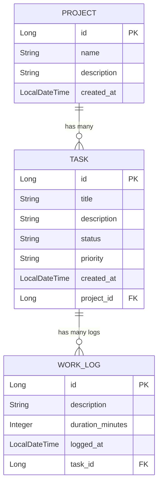

# ⏱️ WorkLog Tracker

**WorkLog Tracker** adalah aplikasi berbasis web yang dibangun dengan ekosistem Spring Boot dan Thymeleaf. Aplikasi ini dirancang untuk memudahkan individu maupun tim dalam melacak waktu (time tracking) yang dihabiskan untuk berbagai tugas dan proyek, memvisualisasikan progress melalui Kanban, serta memonitor tingkat produktivitas.

Dokumen ini berfungsi ganda sebagai **Product Requirements Document (PRD)** sekaligus **Technical Documentation** untuk memberikan panduan komprehensif bagi developer, product manager, maupun pengguna saat mengakses repository ini.

---

## 📋 Bagian 1: Product Requirements Document (PRD)

### 1.1 Latar Belakang
Dalam manajemen proyek modern, mengelola waktu dan melihat alokasi jam kerja pada spesifik tugas merupakan hal krusial untuk evaluasi produktivitas. Tanpa sistem pelacakan yang baik, akan sulit untuk mengetahui berapa lama suatu tugas diselesaikan dan mengevaluasi alokasi sumber daya ke depannya. WorkLog Tracker hadir untuk memecahkan masalah pencatatan waktu manual dengan sistem yang terpusat, otomatis, visual (Kanban), dan mudah dikelola.

### 1.2 Tujuan Aplikasi
- Menyediakan platform terpadu untuk membuat dan mengelola portofolio Proyek.
- Memungkinkan pengguna memecah proyek menjadi Tugas (Tasks) yang memiliki parameter jelas (seperti tingkat prioritas dan status progres) serta memvisualisasikannya di Papan Kanban.
- Memfasilitasi pengguna untuk mencatat waktu kerja (WorkLogs) mereka di setiap tugas secara akurat dalam satuan menit.
- Menyediakan statistik global tingkat tinggi (Dashboard) terkait produktivitas.

### 1.3 Target Pengguna
- **Freelancer / Independent Contractor:** Untuk melacak *billable hours* yang akurat bagi klien.
- **Software Engineer / Pekerja Profesional:** Untuk pencatatan *timesheet* harian.
- **Project Manager:** Untuk memonitor progres penyelesaian tugas melalui metrik Kanban dan mengevaluasi total durasi pengerjaan oleh tim.

### 1.4 Fitur Utama (Core Features)
1. **Global Dashboard & Statistics:**
   - Halaman utama (Home) yang merangkum keseluruhan proyek, menampilkan total tugas, pemisahan status tugas (Completed, In Progress, Blocked), serta agregasi total menit kerja secara global.
2. **Manajemen Proyek (Project Management):**
   - *Create, Read, Update, Delete (CRUD)* data Proyek.
   - Entitas dengan atribut: Nama Proyek, Deskripsi, dan Tanggal Dibuat.
3. **Papan Kanban Proyek (Kanban Board View):**
   - Tampilan visual board untuk setiap proyek, memetakan setiap tugas berdasarkan statusnya.
   - Kemampuan pembaruan status cepat (Quick Update Status).
4. **Manajemen Tugas Terintegrasi & Filter Pencarian (Task Management & Search):**
   - *CRUD* Tugas dalam hierarki spesifik (nested) di bawah sebuah proyek.
   - Halaman pencarian global untuk mencari tugas berdasar kata kunci (*keyword*), filter status, dan prioritas.
   - Status meliputi: `TODO`, `IN_PROGRESS`, `DONE`, dan `BLOCKED` (Terkendala).
   - Prioritas meliputi: `LOW`, `MEDIUM`, `HIGH`.
5. **Pencatatan Waktu (Time Tracking / Work Log):**
   - Menambahkan catatan kerja (log) ke spesifik tugas.
   - Entitas dengan atribut: Deskripsi Pekerjaan, Durasi (dalam menit - minimal 1 menit), Waktu Log.

### 1.5 User Flow Singkat
1. Pengguna membuka aplikasi dan disajikan **Dashboard** yang berisi metrik ringkasan kinerja.
2. Pengguna membuat sebuah **Proyek** baru, lalu masuk ke tampilan **Kanban Board** proyek tersebut.
3. Di sana, pengguna membuat beberapa **Tugas (Task)** dengan prioritas tertentu.
4. Pengguna dapat melacak seluruh pekerjaannya melalui halaman **Pencarian (Search)** lintas proyek.
5. Saat pengguna mengerjakan tugas, status dapat diubah secara langsung. Setelah itu pengguna masuk ke detail Tugas dan menambahkan **WorkLog**, mencatat deskripsi pekerjaan serta durasi menit yang dihabiskan.

---

## 🛠️ Bagian 2: Technical Documentation

### 2.1 Arsitektur & Stack Teknologi (Tech Stack)
- **Backend Framework:** Java 25, Spring Boot 4.1.1 (Spring Web MVC)
- **ORM & Database:** Spring Data JPA, Hibernate, H2 Database (In-Memory Database untuk *development*)
- **View / Frontend:** Thymeleaf (Server-Side Rendering), HTML/CSS
- **Tools / Libraries:** Lombok (Boilerplate reduction), Spring Boot Validation (Data Integrity API)
- **Build Tool:** Maven

### 2.2 Entity-Relationship Diagram (Database Schema)

Aplikasi ini memiliki 3 entitas utama (`Project`, `Task`, `WorkLog`) dengan relasi sebagai berikut:



#### Detail Entitas:
- **`Project`**: Entitas tertinggi. Memiliki relasi *One-to-Many* ke entitas `Task` dengan *Cascade* (apabila proyek dihapus, seluruh task dan log di dalamnya ikut terhapus).
- **`Task`**: Sub-entitas dari Project. Enum yang digunakan untuk status adalah `TaskStatus` (termasuk `BLOCKED`), dan prioritas `TaskPriority`.
- **`WorkLog`**: Mencatat setiap entri durasi pengerjaan, berelasi *Many-to-One* ke `Task`.

### 2.3 Struktur Direktori (Folder Structure)
Sistem menggunakan *pattern* standard arsitektur **MVC (Model-View-Controller)** dengan tambahan implementasi **DTO** untuk pergerakan data ke UI:

```text
worklog-tracker/
├── pom.xml
└── src/
    └── main/
        ├── java/com/example/worklog_tracker/
        │   ├── controller/     # Layer routing HTTP (menghubungkan ke Thymeleaf Views)
        │   ├── dto/            # Data Transfer Objects (Contoh: DashboardStatsDto)
        │   ├── model/          # Layer data (Entitas JPA, Enum)
        │   ├── repository/     # Layer akses Database (Termasuk custom JPQL queries untuk pencarian)
        │   └── service/        # Layer Business Logic (Seperti DashboardService untuk agregasi metrik)
        │
        └── resources/
            ├── application.properties
            └── templates/
                ├── dashboard.html    # View Global Stats
                ├── layout/           # Template dasar UI
                ├── projects/         # Views modul Proyek (list, form, detail, kanban.html)
                └── tasks/            # Views modul Tugas (form, detail, search.html)
```

### 2.4 API / Endpoint & Routing
Meski menggunakan *Server-Side Rendering*, API internal diatur secara RESTful (terutama *Nested Routes* untuk hierarki sumber daya):

* **`HomeController`**: `/` -> Merender halaman Dashboard (`dashboard.html`).
* **`ProjectController`**: `/projects` (List/Create), `/projects/{id}` (Detail), `/projects/{id}/kanban` (Board view dengan pengelompokan menggunakan Java Streams).
* **`TaskController`**: Mengadopsi **Nested Routing** (`/projects/{projectId}/tasks/...`) untuk modifikasi task yang spesifik pada suatu proyek. Terdapat juga `/tasks/search` yang menggunakan pencarian JPQL dinamis lintas-proyek (Global Search).
* **`WorkLogController`**: Mengelola form submission untuk entri pengerjaan di suatu task.

### 2.5 Instalasi & Cara Menjalankan (Installation & Setup)

#### Prasyarat (Prerequisites)
- Java Development Kit (JDK) versi **25**.

#### Langkah-langkah:
1. **Clone Repository**
   ```bash
   git clone <repository_url>
   cd worklog-tracker
   ```

2. **Kompilasi & Build Aplikasi**
   - Di OS Windows: `.\mvnw.cmd clean install`
   - Di OS Mac/Linux: `./mvnw clean install`

3. **Jalankan Aplikasi**
   Aplikasi dan database otomatis diinisialisasi melalui anotasi Entity.
   - Di OS Windows: `.\mvnw.cmd spring-boot:run`
   - Di OS Mac/Linux: `./mvnw spring-boot:run`

4. **Akses Aplikasi**
   - Web App UI (Dashboard Home): `http://localhost:8080`
   - Database H2 Console: `http://localhost:8080/h2-console`
     *(Konfigurasi Console - JDBC URL: `jdbc:h2:mem:worklogdb`, Username: `sa`, Password kosong).*

---
*Dibuat untuk mempermudah pemahaman arsitektur dan kegunaan aplikasi WorkLog Tracker.*
